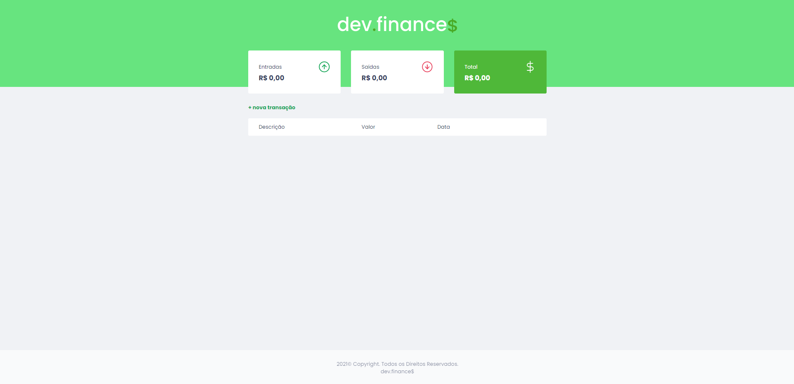
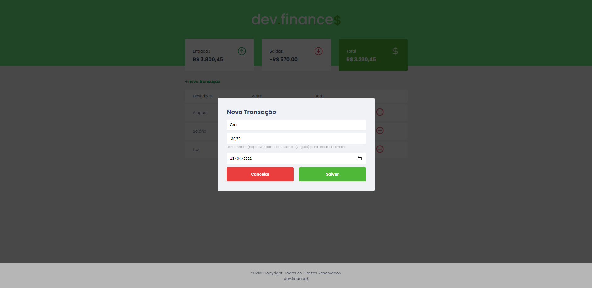
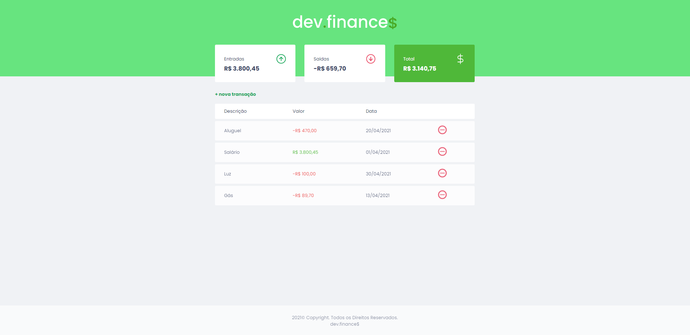

 

--------------------------------------------------------------------------------

## ✨ Funcionamento:
-  Registro de Entradas
-  Registro de Saídas
- [x] Cálculo do Total
-  Adicionar transação
-   Remover transação
- [x] Tabela com os campos:
- [x] Descrição
- [x] Valor
- [x] Data
 - [x]  Modal:
-  Salvar transação
- [x]  Cancelar ação
- [x]  Responsividade para mobile e desktop

###  💻 Tecnologias:
#### As seguintes tecnologias foram usadas na construção do projeto:

* HTML
* JavaScript

### 🎨 Layout:
- CSS

### 📂 Como instalar o projeto:
### Passo 1. Clone este repositório no seu terminal/cmd:

$ git clone https://github.com/SamantaSouza357/Dev.finance.git

### Passo 2. Acesse a pasta do projeto:

$ cd Dev.finance

Passo 3. Abra o projeto em sua IDE preferida.

📷 Prints:

 

  

   

    

